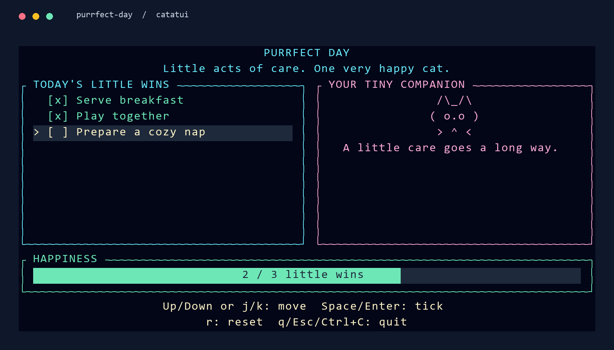

# Getting started: a purrfect little terminal app

**Basic Go in. Happy cat out.** Let's build **Purrfect Day**: a tiny dashboard
where you tick off three acts of care and watch a cat's happiness bar fill up.
You'll learn layout, styling, widgets, and keyboard input along the way.
No terminal-UI experience needed.



*The finished app, with two little wins. Complete the third to earn a smile.*

Want to meet the cat first? From this repository's root, run:

```sh
go run ./examples/apps/getting-started
```

| Key | What happens |
|---|---|
| Up / Down or k / j | Select a task |
| Space or Enter | Tick it off, or undo it |
| r | Start a fresh day |
| q, Escape, or Ctrl+C | Quit and return to your shell |

Prefer to build it yourself? Follow the five steps below. Every step ends with
something you can run. Your progress lives in memory; quitting starts a fresh
day next time.

## Before we start

You'll need **Go 1.27.0 or newer** (the version required by this checkout's
`go.mod`), a text editor, and a terminal. Check your installation with
`go version`. Use a terminal window at least **40 columns by 18 rows**; at
72 columns or wider, the two cards sit side by side.

In a directory outside the catatui checkout, create a new project:

```sh
mkdir purrfect-day
cd purrfect-day
go mod init example.com/purrfect-day
go get github.com/Fiend3d/catatui
```

These commands work in PowerShell and Unix shells. Put each step's code in a
file named `main.go` inside `purrfect-day`. Run it with `go run .` and quit the
app before editing the next step.

> **Working from a local catatui checkout?** Before `go get`, run
> `go mod edit -replace=github.com/Fiend3d/catatui=/absolute/path/to/catatui`
> using your checkout's real path. In PowerShell, a path might look like
> `C:/projects/catatui`. Quote the entire `-replace=...` argument if it has spaces.
> This makes your new project use the code on your machine.

## 1. Say hello

**Your first win:** draw text, then return safely to your shell.

Paste this whole program into `main.go`:

```go
package main

import (
	"fmt"
	"os"

	"github.com/Fiend3d/catatui"
	"github.com/Fiend3d/catatui/term"
	"github.com/Fiend3d/catatui/widgets"
)

type app struct{ quit bool }

func newApp() *app { return &app{} }

func main() {
	if err := run(); err != nil {
		fmt.Fprintln(os.Stderr, "error:", err)
		os.Exit(1)
	}
}

func run() error {
	defer term.RecoverAndRestore()
	terminal, restore, err := term.Init()
	if err != nil {
		return err
	}
	defer restore()

	events := term.NewEventReader(os.Stdin, os.Stdout)
	defer events.Close()
	a := newApp()
	for !a.quit {
		if err := terminal.Draw(a.draw); err != nil {
			return err
		}
		// Wait for input or a resize instead of repeatedly drawing an idle app.
		ev, ok := <-events.Events()
		if !ok {
			return events.Err()
		}
		a.handle(ev)
	}
	return nil
}

func (a *app) handle(ev term.Event) {
    if ev.IsRune('q') || ev.IsKey(term.KeyEscape) || ev.IsCtrl('c') {
        a.quit = true
    }
}

func (a *app) draw(f *catatui.Frame) {
    f.RenderWidget(widgets.NewParagraph("Hello, human!\nYour cat dashboard starts here.\nPress q to quit."), f.Area())
}
```

Run `go run .`. Hello, human! Press **q** to return to your shell.

Here's what the small pieces do:

- `term.Init()` prepares the terminal and gives you a `restore` function.
  `defer restore()` puts your shell back when `run` returns;
  `RecoverAndRestore` also handles a panic.
- `terminal.Draw(a.draw)` gives your drawing function a **frame**: the screen
  area available right now. A **widget** is something that can draw in an area.
  Here, `Paragraph` is our text widget and `f.Area()` is the whole screen.
- `EventReader` delivers keys and resize events. Receiving from its channel
  waits until something happens; our code doesn't keep repainting while idle.
- `handle` changes the app's data; `draw` displays it. Closing the event stream
  or encountering an error exits through the same cleanup path.

The rhythm is **draw → wait for input → update state → draw again**.
You describe the whole screen each time; catatui sends the changed cells to
the terminal for you.

**Try it:** change “Hello, human!” to your cat's name. Run it again.

## 2. Give it a little style

**Your next win:** a dashboard with colorful, rounded cards.

Add this import inside the existing `import (...)` block:

```go
"github.com/Fiend3d/catatui/palette/tailwind"
```

Add these style variables and the `panel` helper after your existing functions:

```go
var (
	baseStyle = catatui.NewStyle().Fg(tailwind.Amber.C100).Bg(tailwind.Slate.C950)
	cyanStyle = catatui.NewStyle().Fg(tailwind.Cyan.C300)
	pinkStyle = catatui.NewStyle().Fg(tailwind.Pink.C300)
	mintStyle = catatui.NewStyle().Fg(tailwind.Emerald.C300)
)

func panel(title string, style catatui.Style) widgets.Block {
	return widgets.Bordered().Title(" " + title + " ").
		BorderType(widgets.BorderRounded).BorderStyle(style).
		Padding(widgets.HorizontalPadding(1))
}
```

A style describes colors and emphasis. Builder calls such as `.Fg(...)` return
an updated value, so you can chain them. A `Block` supplies a border and title;
our `panel` helper gives every card the same rounded corners and inner padding.

Now **replace the entire `draw` method** with:

```go
func (a *app) draw(f *catatui.Frame) {
	area := f.Area()
	f.Buffer().SetStyle(area, baseStyle)
	if area.Width < 40 || area.Height < 18 {
		f.RenderWidget(widgets.NewParagraph("Purrfect Day\nResize to at least 40 x 18.\nq / Esc / Ctrl+C: quit").
			Wrap(widgets.Wrap{Trim: true}), area)
		return
	}

	rows := catatui.VerticalLayout(
		catatui.Length(2), catatui.Fill(1), catatui.Length(3), catatui.Length(2),
	).Split(area)
	f.RenderWidget(widgets.NewParagraph("PURRFECT DAY\nLittle acts of care. One very happy cat.").
		Style(cyanStyle.AddModifier(catatui.ModifierBold)).Centered(), rows[0])

	panes := catatui.HorizontalLayout(catatui.Percentage(50), catatui.Fill(1)).
		Spacing(catatui.Space(1)).Split(rows[1])
	if area.Width < 72 {
		panes = catatui.VerticalLayout(catatui.Length(5), catatui.Fill(1)).Split(rows[1])
	}
	f.RenderWidget(widgets.NewParagraph("Breakfast, playtime, a cozy nap.").
        Block(panel("TODAY'S LITTLE WINS", cyanStyle)), panes[0])
	f.RenderWidget(widgets.NewParagraph("Hello, human!").Centered().
        Block(panel("YOUR TINY COMPANION", pinkStyle)).Style(pinkStyle), panes[1])
	f.RenderWidget(widgets.NewParagraph("Happiness is on its way.").
        Block(panel("HAPPINESS", mintStyle)), rows[2])
	f.RenderWidget(widgets.NewParagraph("q/Esc/Ctrl+C: quit").
		Centered(), rows[3])
}
```

Run `go run .`. You now have a dashboard! Only the quit keys work so far.

`VerticalLayout` divides the screen into rows. `Length(2)` reserves two terminal
rows, while `Fill(1)` takes the remaining space. The middle row splits into two
columns with `HorizontalLayout`. Each widget gets one of those rectangles.
No pixel coordinates needed.

Below 72 columns, we stack the cards. Below 40 × 18, we show a resize hint.
Resize the window now: the event reader wakes the loop and the next frame uses
the new dimensions. The same app data survives the redraw.

**Try it:** change `tailwind.Cyan.C300` to `tailwind.Violet.C300` for a lilac header.

## 3. Make room for little wins

**Your next win:** three tasks, with the first one highlighted.

Replace `type app struct{ quit bool }` and `newApp` with these definitions:

```go
type task struct {
	name string
	done bool
}

// Keep data between frames; rebuild the widgets when drawing each frame.
type app struct {
	tasks []task
	list  widgets.ListState
	quit  bool
}

func newApp() *app {
	return &app{
		tasks: []task{{name: "Serve breakfast"}, {name: "Play together"}, {name: "Prepare a cozy nap"}},
		list:  widgets.NewListState().WithSelected(0),
	}
}
```

`tasks` holds our data. `ListState` remembers the selected row between draws.
The list widget itself will be rebuilt each frame, using that saved state.

Add this method below `draw`:

```go
func (a *app) renderTasks(f *catatui.Frame, area catatui.Rect) {
	items := make([]widgets.ListItem, len(a.tasks))
	for i, task := range a.tasks {
		mark, style := "[ ] ", baseStyle
		if task.done {
			mark, style = "[x] ", mintStyle
		}
		items[i] = widgets.NewListItem(mark + task.name).Style(style)
	}
	list := widgets.NewList(items...).Block(panel("TODAY'S LITTLE WINS", cyanStyle)).
		HighlightSymbol("> ").HighlightSpacing(widgets.HighlightSpacingAlways).
		HighlightStyle(catatui.NewStyle().Bg(tailwind.Slate.C800).AddModifier(catatui.ModifierBold))
	catatui.RenderStatefulWidget(list, area, f.Buffer(), &a.list)
}
```

Inside `draw`, replace the paragraph that says “Breakfast, playtime, a cozy nap.”
(the whole `f.RenderWidget(...)` call ending with `panes[0])`) with:

```go
a.renderTasks(f, panes[0])
```

Run `go run .`. You should see three empty checkboxes and a `>` beside breakfast.
The highlight is visible through both its background and its marker.

`RenderStatefulWidget` takes `&a.list` so the widget can read the selection and
adjust its scroll position. The app owns the data; the widget draws it.

**Try it:** rename “Serve breakfast” to “Serve the fancy breakfast.” Keep the
three tasks for now; short names fit best in the side-by-side layout.

## 4. Let the keyboard in

**Your next win:** move, tick, undo, and reset.

Replace the entire `handle` method with:

```go
func (a *app) handle(ev term.Event) {
	if ev.Kind != term.EventKey {
		return // The loop still redraws after resize events.
	}
	i, _ := a.list.Selected()
	switch {
	case ev.IsRune('q'), ev.IsKey(term.KeyEscape), ev.IsCtrl('c'):
		a.quit = true
	case ev.IsKey(term.KeyUp), ev.IsRune('k'):
		a.list.Select(max(0, i-1))
	case ev.IsKey(term.KeyDown), ev.IsRune('j'):
		a.list.Select(min(len(a.tasks)-1, i+1))
	case ev.IsRune(' '), ev.IsKey(term.KeyEnter):
		a.tasks[i].done = !a.tasks[i].done
	case ev.IsRune('r'):
		*a = *newApp()
	}
}
```

In `draw`, change the footer paragraph's string from `"q/Esc/Ctrl+C: quit"` to:

```go
"Up/Down or j/k: move  Space/Enter: tick\nr: reset  q/Esc/Ctrl+C: quit"
```

Run `go run .`. Select a task with Down, then press Space. One little win!
Press it again to undo. **r** restores all three tasks and selects breakfast.

`IsRune` matches a printable key, `IsKey` matches keys such as arrows, and
`IsCtrl` checks a control shortcut. We stop at the first and last tasks using
`min` and `max`. Notice that `handle` never draws: the loop does that after
applying the change.

**Try it:** tick two tasks, resize the terminal, then untick one. Your state
stays with you even when the layout changes.

## 5. Earn a happy cat

**Your final win:** a happiness meter and a smiling companion.

Add these three methods after your existing functions:

```go
func (a *app) completed() int {
	n := 0
	for _, task := range a.tasks {
		if task.done {
			n++
		}
	}
	return n
}

func (a *app) renderCat(f *catatui.Frame, area catatui.Rect) {
	face, message := "( o.o )", "A little care goes a long way."
	if a.completed() == len(a.tasks) {
		face, message = "( ^.^ )", "One happy cat. Nicely done!"
	}
	cat := ` /\_/\` + "\n" + face + "\n > ^ <\n" + message
	f.RenderWidget(widgets.NewParagraph(cat).Centered().
		Block(panel("YOUR TINY COMPANION", pinkStyle)).Style(pinkStyle), area)
}

func (a *app) renderHappiness(f *catatui.Frame, area catatui.Rect) {
	n := a.completed()
	f.RenderWidget(widgets.NewGauge().
		Block(panel("HAPPINESS", mintStyle)).
		Ratio(float64(n)/float64(len(a.tasks))).
		Label(fmt.Sprintf("%d / %d little wins", n, len(a.tasks))).
		GaugeStyle(mintStyle.Bg(tailwind.Slate.C800)), area)
}
```

Inside `draw`, replace the entire “Hello, human!” paragraph call ending with
`panes[1])` with `a.renderCat(f, panes[1])`. Replace the entire “Happiness is on
its way.” paragraph call ending with `rows[2])` with `a.renderHappiness(f, rows[2])`.

Run `go run .` and tick all three tasks. **One happy cat. Nicely done!**

The gauge takes a ratio from 0 to 1. We calculate it from the number of completed
tasks, so the meter, checkboxes, and cat always agree. The label also shows the
count in words. Undoing a task lowers the meter and brings the original face back.

**Try it:** give the celebration message your own personality. Keep it short
enough to fit the card at the smallest side-by-side width.

## The complete program

If you want a clean copy, replace `main.go` with the program below. It matches
[the runnable example](../examples/apps/getting-started/main.go) exactly; a test
checks that they stay in sync.

<details>
<summary>Show the complete Purrfect Day source</summary>

<!-- final-program -->
```go
// Command getting-started is Purrfect Day, the app built in docs/getting-started.md.
//
//	go run ./examples/apps/getting-started
//
// Up/Down or j/k select, Space/Enter toggle, r resets, q/Esc/Ctrl+C quit.
package main

import (
	"fmt"
	"os"

	"github.com/Fiend3d/catatui"
	"github.com/Fiend3d/catatui/palette/tailwind"
	"github.com/Fiend3d/catatui/term"
	"github.com/Fiend3d/catatui/widgets"
)

type task struct {
	name string
	done bool
}

// Keep data between frames; rebuild the widgets when drawing each frame.
type app struct {
	tasks []task
	list  widgets.ListState
	quit  bool
}

func newApp() *app {
	return &app{
		tasks: []task{{name: "Serve breakfast"}, {name: "Play together"}, {name: "Prepare a cozy nap"}},
		list:  widgets.NewListState().WithSelected(0),
	}
}

func main() {
	if err := run(); err != nil {
		fmt.Fprintln(os.Stderr, "error:", err)
		os.Exit(1)
	}
}

func run() error {
	defer term.RecoverAndRestore()
	terminal, restore, err := term.Init()
	if err != nil {
		return err
	}
	defer restore()

	events := term.NewEventReader(os.Stdin, os.Stdout)
	defer events.Close()
	a := newApp()
	for !a.quit {
		if err := terminal.Draw(a.draw); err != nil {
			return err
		}
		// Wait for input or a resize instead of repeatedly drawing an idle app.
		ev, ok := <-events.Events()
		if !ok {
			return events.Err()
		}
		a.handle(ev)
	}
	return nil
}

func (a *app) handle(ev term.Event) {
	if ev.Kind != term.EventKey {
		return // The loop still redraws after resize events.
	}
	i, _ := a.list.Selected()
	switch {
	case ev.IsRune('q'), ev.IsKey(term.KeyEscape), ev.IsCtrl('c'):
		a.quit = true
	case ev.IsKey(term.KeyUp), ev.IsRune('k'):
		a.list.Select(max(0, i-1))
	case ev.IsKey(term.KeyDown), ev.IsRune('j'):
		a.list.Select(min(len(a.tasks)-1, i+1))
	case ev.IsRune(' '), ev.IsKey(term.KeyEnter):
		a.tasks[i].done = !a.tasks[i].done
	case ev.IsRune('r'):
		*a = *newApp()
	}
}

func (a *app) completed() int {
	n := 0
	for _, task := range a.tasks {
		if task.done {
			n++
		}
	}
	return n
}

var (
	baseStyle = catatui.NewStyle().Fg(tailwind.Amber.C100).Bg(tailwind.Slate.C950)
	cyanStyle = catatui.NewStyle().Fg(tailwind.Cyan.C300)
	pinkStyle = catatui.NewStyle().Fg(tailwind.Pink.C300)
	mintStyle = catatui.NewStyle().Fg(tailwind.Emerald.C300)
)

func panel(title string, style catatui.Style) widgets.Block {
	return widgets.Bordered().Title(" " + title + " ").
		BorderType(widgets.BorderRounded).BorderStyle(style).
		Padding(widgets.HorizontalPadding(1))
}

func (a *app) draw(f *catatui.Frame) {
	area := f.Area()
	f.Buffer().SetStyle(area, baseStyle)
	if area.Width < 40 || area.Height < 18 {
		f.RenderWidget(widgets.NewParagraph("Purrfect Day\nResize to at least 40 x 18.\nq / Esc / Ctrl+C: quit").
			Wrap(widgets.Wrap{Trim: true}), area)
		return
	}

	rows := catatui.VerticalLayout(
		catatui.Length(2), catatui.Fill(1), catatui.Length(3), catatui.Length(2),
	).Split(area)
	f.RenderWidget(widgets.NewParagraph("PURRFECT DAY\nLittle acts of care. One very happy cat.").
		Style(cyanStyle.AddModifier(catatui.ModifierBold)).Centered(), rows[0])

	panes := catatui.HorizontalLayout(catatui.Percentage(50), catatui.Fill(1)).
		Spacing(catatui.Space(1)).Split(rows[1])
	if area.Width < 72 {
		panes = catatui.VerticalLayout(catatui.Length(5), catatui.Fill(1)).Split(rows[1])
	}
	a.renderTasks(f, panes[0])
	a.renderCat(f, panes[1])
	a.renderHappiness(f, rows[2])
	f.RenderWidget(widgets.NewParagraph("Up/Down or j/k: move  Space/Enter: tick\nr: reset  q/Esc/Ctrl+C: quit").
		Centered(), rows[3])
}

func (a *app) renderTasks(f *catatui.Frame, area catatui.Rect) {
	items := make([]widgets.ListItem, len(a.tasks))
	for i, task := range a.tasks {
		mark, style := "[ ] ", baseStyle
		if task.done {
			mark, style = "[x] ", mintStyle
		}
		items[i] = widgets.NewListItem(mark + task.name).Style(style)
	}
	list := widgets.NewList(items...).Block(panel("TODAY'S LITTLE WINS", cyanStyle)).
		HighlightSymbol("> ").HighlightSpacing(widgets.HighlightSpacingAlways).
		HighlightStyle(catatui.NewStyle().Bg(tailwind.Slate.C800).AddModifier(catatui.ModifierBold))
	catatui.RenderStatefulWidget(list, area, f.Buffer(), &a.list)
}

func (a *app) renderCat(f *catatui.Frame, area catatui.Rect) {
	face, message := "( o.o )", "A little care goes a long way."
	if a.completed() == len(a.tasks) {
		face, message = "( ^.^ )", "One happy cat. Nicely done!"
	}
	cat := ` /\_/\` + "\n" + face + "\n > ^ <\n" + message
	f.RenderWidget(widgets.NewParagraph(cat).Centered().
		Block(panel("YOUR TINY COMPANION", pinkStyle)).Style(pinkStyle), area)
}

func (a *app) renderHappiness(f *catatui.Frame, area catatui.Rect) {
	n := a.completed()
	f.RenderWidget(widgets.NewGauge().
		Block(panel("HAPPINESS", mintStyle)).
		Ratio(float64(n)/float64(len(a.tasks))).
		Label(fmt.Sprintf("%d / %d little wins", n, len(a.tasks))).
		GaugeStyle(mintStyle.Bg(tailwind.Slate.C800)), area)
}
```

</details>

## Where to take your cat next

You built a real terminal app: persistent state, a responsive layout, styled
widgets, and a keyboard event loop. A few small experiments to make it yours:

- **Give it a new look.** Change the palette and title. See [text and style](concepts/text-and-style.md).
- **Rearrange the cards.** Try a different column percentage, keeping room for
  the text in both panels. See [layout](concepts/layout.md).
- **Add a fourth task.** Add an entry in `newApp`, increase the stacked list's
  `Length(5)` to `Length(6)`, and raise the minimum height from 18 to 19 in both
  the condition and resize message. The completion count adjusts automatically.
- **Explore more widgets.** Start with [the widget guide](concepts/widgets.md).
- **Test without a terminal.** Use `TestBackend` to draw into memory, as shown
  in [testing](concepts/testing.md) and this example's tests.

For a closer look at the drawing cycle, read [rendering](concepts/rendering.md).
For input handling and batching queued events in busier apps, read
[events](concepts/events.md).

## If something gets stuck

| What you see | What to try |
|---|---|
| A Go version error | Run `go version`; this checkout requires Go 1.27.0 or newer. |
| A terminal initialization error | Run from an interactive terminal, not a redirected pipe or an editor's output pane. |
| A resize hint | Enlarge the terminal to at least 40 columns × 18 rows. Quit keys still work. |
| Different colors | Colors depend on your terminal; use a true-color terminal for the palette shown above. |
| An unused import or duplicate method error | Add the palette import in step 2, and replace methods where directed instead of keeping both versions. The complete program is available above. |
